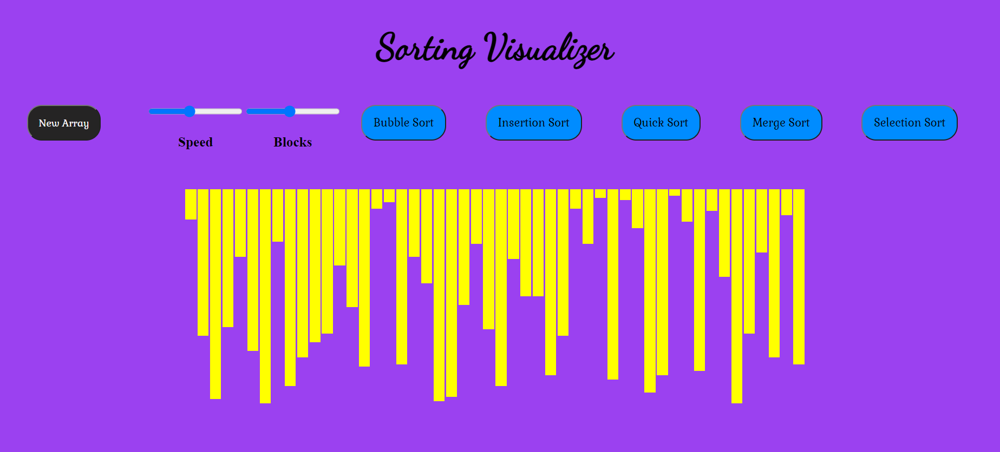
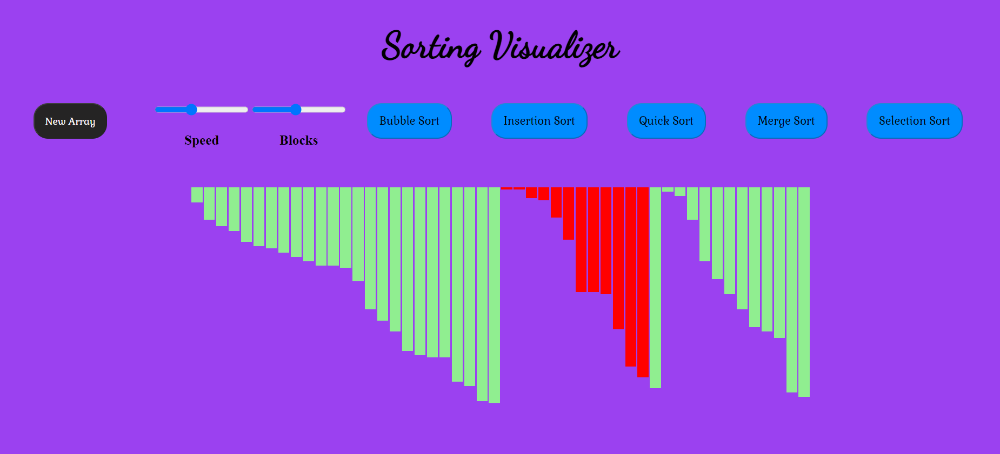
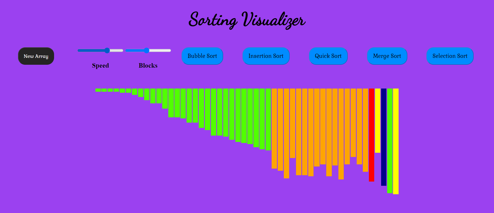

## Sorting Visualizer Web App
**A simple Sorting Visualizer User Inteface, which provides you with various sorting algorithms to visualize with adjustable speed of visualization and no. of blocks.**

## User Interface

## Merge Sort

## Quick Sort

## Tools used:
1. Frontend: 
   * HTML, CSS, and JavaScript are used to Build the User Interface.
2. Algorithms:
   * Various Sorting Algorithms like bubble sort, merge sort etc., are used. 

## To Run
* Simply Install Live Server Extension and click on "Go Live".
* A web page will open up in the browser at address http://127.0.0.1:5501/ to access the User Interface.
